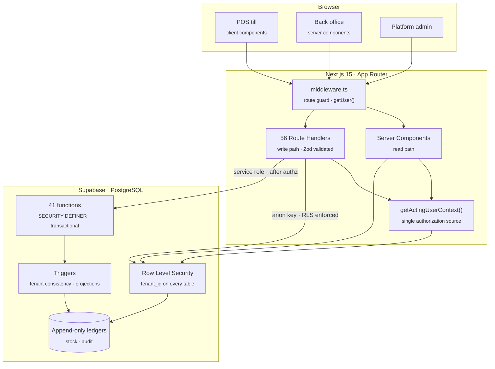
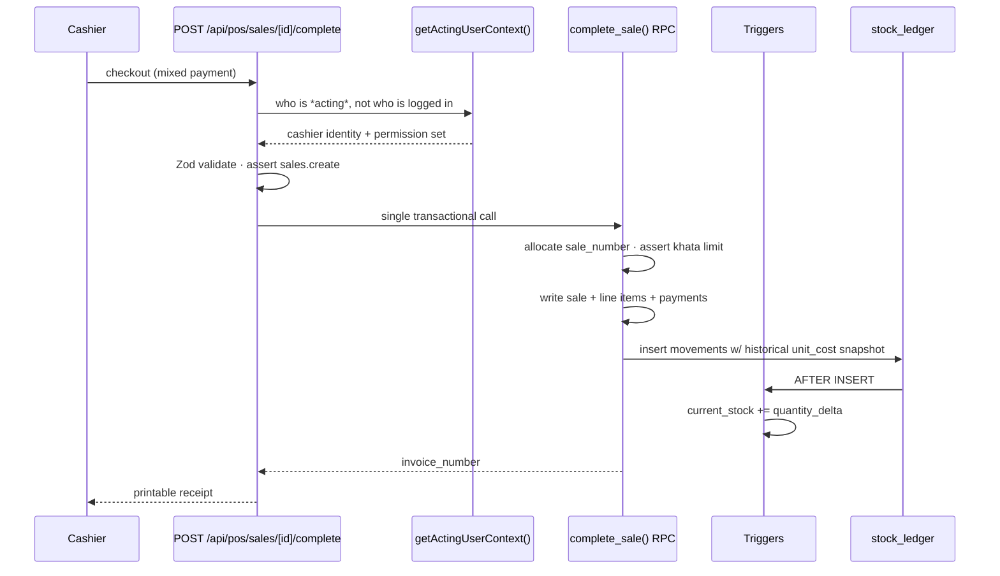
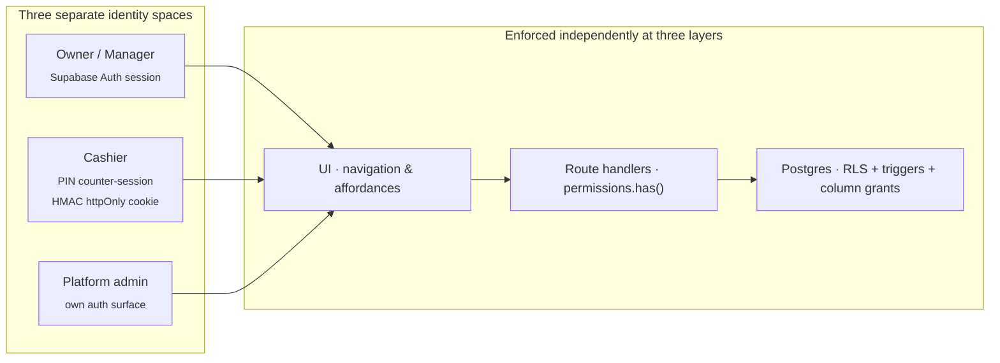

<div align="center">

<h1>RetailFlow</h1>

**A multi-tenant retail POS, inventory and credit-ledger platform, engineered for South Asian shops.**

Barcode billing, weighted-average costing, *khata* credit ledgers, shift reconciliation
and audited money trails — on a Postgres schema where every tenant is isolated by
Row Level Security and every rupee is an integer.

<br/>

[](https://nextjs.org)
[](https://react.dev)
[](https://www.typescriptlang.org)
[](https://supabase.com)
[](https://tailwindcss.com)

<br/>

<table>
<tr>
<td align="center"><strong>35</strong><br/><sub>Postgres tables</sub></td>
<td align="center"><strong>92</strong><br/><sub>SQL migrations</sub></td>
<td align="center"><strong>41</strong><br/><sub>DB functions / RPCs</sub></td>
<td align="center"><strong>56</strong><br/><sub>API route handlers</sub></td>
<td align="center"><strong>231</strong><br/><sub>automated tests</sub></td>
<td align="center"><strong>22</strong><br/><sub>granular permissions</sub></td>
</tr>
</table>

</div>

---

> Most retail software assumes a shop where every item carries a barcode, every sale is paid in full,
> and the day ends when the last customer walks out. **RetailFlow** is built for the other kind — where
> rice is scooped out by the *pao*, half the regulars are on *khata*, and the cash drawer has to
> reconcile to the paisa before anyone goes home. Not a generic POS with the currency symbol swapped
> out: a system that models how these shops actually trade.

---

## Contents

- [Why this exists](#why-this-exists)
- [What it does](#what-it-does)
- [Architecture](#architecture)
- [Engineering decisions worth reading](#engineering-decisions-worth-reading)
- [Security model](#security-model)
- [Testing strategy](#testing-strategy)
- [Project layout](#project-layout)
- [Getting started](#getting-started)
- [Deployment](#deployment)
- [Roadmap](#roadmap)

---

## Why this exists

A Pakistani *kiryana* store does not trade like a Western retailer, and off-the-shelf POS software
quietly assumes it does.

| Reality on the shop floor | What generic POS software assumes |
|---|---|
| Half the day's sales go on **khata** — informal credit, settled whenever | Every sale is paid at checkout |
| Stock arrives in *bori*, *theli*, *gross* — units that vary shop to shop | A fixed, universal unit catalogue |
| One bill is split across cash + credit + JazzCash in the same transaction | One bill, one payment method |
| A cashier hands the counter to another mid-shift, on the same device | One login, one session, one person |
| The business day runs past midnight; "today" is not a UTC date | `created_at::date` is good enough |
| The drawer must reconcile to the paisa, or someone is accused of theft | Reconciliation is a nice-to-have report |

RetailFlow is built around those six facts. Everything below follows from them.

---

## What it does

<table>
<tr><td width="50%" valign="top">

### Point of sale
Barcode-scanner or search-driven billing in a two-pane till layout. Per-line and bill-level
discounts (permission-gated). **Mixed payment on a single bill** — cash, khata, JazzCash/Easypaisa
reference. Hold & recall parked bills. Returns, exchanges and full voids with reasons. Printable
receipts itemised with Urdu product names. Cash round-off handling.

</td><td width="50%" valign="top">

### Shifts & cash control
Open a shift with a declared opening float; close it against expected-vs-actual cash with a
variance report. Cash khata receipts and drawer expenses fold into the shift's expected total —
but *only* when they genuinely belong to that drawer, so office-safe cash never manufactures a
shortage a cashier didn't cause.

</td></tr>
<tr><td width="50%" valign="top">

### Inventory
Multi-unit products with conversion factors (carton → packet → piece). Bilingual names
(English + Urdu). Multiple barcodes per product. Nested categories with depth limits. Bulk
opening-stock CSV import with per-row validation and an error report. **Append-only stock ledger**
as the single source of truth. Low-stock alerts, reorder levels, reason-coded adjustments
(damage / theft / wastage).

</td><td width="50%" valign="top">

### Purchasing & costing
Supplier master with credit terms and a running payables ledger. Purchase orders with
**partial goods receipt** — receive 40 of 100 cartons and the books stay correct. Purchase
returns. A **weighted-average costing engine** that re-derives average cost on every receipt and
stamps a historical cost snapshot onto each sale, so past margins never silently rewrite
themselves when today's cost changes.

</td></tr>
<tr><td width="50%" valign="top">

### Khata (credit ledger)
Running per-customer balances with credit limits enforced at the database layer. Partial payment
allocation across outstanding bills. Aging buckets for receivables *and* payables. Blacklist /
stop-supply flags. Per-customer statement export.

</td><td width="50%" valign="top">

### Reports & audit
Daily sales summary, cashier-wise performance, margin/COGS, stock valuation, cash book, expense
tracking with editable categories. CSV export on every report and ledger. Full-database backup
export (owner-only). An **append-only audit log** recording both *who acted* and *whose session
they acted under* — the two questions a single actor column can never answer.

</td></tr>
<tr><td width="50%" valign="top">

### Roles & access
Three roles (owner / manager / cashier) over **22 granular permissions**, enforced at the
Postgres RLS layer, the route-handler layer and the UI layer independently. PIN-based counter
login for fast cashier hand-off on a shared device — without ever handing that cashier the
owner's authority.

</td><td width="50%" valign="top">

### Platform operations
A separate admin surface — its own identity space, not a super-role inside a tenant — for tenant
lifecycle management: trials, subscription status (`trialing` → `active` → `past_due` →
`suspended`), suspension with a graceful account-suspended page, and multi-channel tenant
notifications (in-app, email via Resend, WhatsApp Cloud API) with its own admin audit trail.

</td></tr>
</table>

---

## Architecture

A single Next.js application: React Server Components render the back office, Route Handlers own
every mutation, and Postgres owns the truth.



### The two paths, and why they differ

| | Read path | Write path |
|---|---|---|
| **Runs in** | Server Components | Route Handlers |
| **Postgres identity** | `authenticated` (anon key) | `service_role`, *after* an explicit permission check |
| **Protected by** | RLS `SELECT` policies | `getActingUserContext()` + `permissions.has()` + tenant-consistency triggers |
| **Why** | RLS is the cheapest correct filter for reads — it cannot be forgotten | Multi-table money movements must be transactional and atomic, which means an RPC, which means bypassing RLS — so authorization moves up into application code, and the DB re-checks tenant consistency in triggers |

Every tenant-scoped table carries `SELECT`-only RLS for clients. There is no client-side
`INSERT`/`UPDATE` policy on any financial table — derived columns like `products.current_stock`
therefore never need column-privilege hardening, because no client write path exists to narrow in
the first place.

### Transaction flow — a completed sale



One RPC, one transaction. A sale either lands completely — stock, money, ledger, invoice number —
or not at all. There is no intermediate state in which the drawer and the shelf disagree.

---

## Engineering decisions worth reading

<details open>
<summary><strong>1. Money is an integer number of paisa. Everywhere. Without exception.</strong></summary>

<br/>

Never a float — not in Postgres (`integer`/`bigint`, never `float`/`real`), not in TypeScript, not
in transit. `src/lib/money.ts` is the *only* sanctioned boundary between integer paisa and
anything float-ish (form inputs, display strings). Weight follows the identical rule in grams via
`src/lib/weight.ts`.

This is not pedantry. `0.1 + 0.2 !== 0.3` is a rounding error a shopkeeper reads as theft, and it
compounds silently across a day of transactions until the drawer doesn't reconcile and someone
gets blamed.

</details>

<details open>
<summary><strong>2. A real privilege-escalation bug — and the test that now makes it unrepeatable</strong></summary>

<br/>

PIN counter-login layers a short-lived, HMAC-signed, `httpOnly` cookie *on top of* an
owner/manager's still-live Supabase session, because a cashier hand-off on a shared device must
take under two seconds. The consequence is subtle and was, briefly, exploitable:

> Back-office code that authorized against the **session** identity let a cashier PIN'd in at the
> counter act with **owner** permissions — create staff accounts, adjust stock, pay suppliers, read
> every cost price. The navigation even linked them straight there. The role model only held on the
> single screen the cashier was supposed to be confined to.

The fix was structural, not a patch:

- `getActingUserContext()` is the **only** valid source for an authorization decision — Server
  Components and Route Handlers alike, back office included.
- `getSessionUserContext()` answers a different question ("whose login is this device on") and is
  consumed by exactly one file, the counter-login route that cannot ask who's at the counter
  without being circular.
- The acting user's role is re-resolved from the database on every request. The cookie's embedded
  `roleKey` is never authoritative — an owner can change a cashier's role mid-shift.
- **`tests/unit/authorization-identity.test.ts` statically fails the build** if a new file
  authorizes from the session identity, or if a route gates on `permissions.has()` without first
  resolving the acting user.

Because Postgres has zero visibility into "who is standing at the counter", RLS *cannot* enforce
this. Anything role-dependent for a cashier is re-checked server-side, per request, against the
live database.

</details>

<details>
<summary><strong>3. Hiding a sensitive field in JSX is not enforcement</strong></summary>

<br/>

A Server Component's fetched data reaches the browser inside the RSC payload whether or not the JSX
renders it. `{canSeeCost && <Cell value={cost} />}` leaks the cost price to anyone who opens the
network tab.

Cost price is therefore either omitted from the `select()` outright — preferred in Route Handlers,
where the response *is* the browser boundary, so the value never leaves Postgres — or nulled out at
projection time. A `select()` string built from a ternary is deliberately avoided: it defeats
supabase-js's literal-type inference and silently collapses the row type to `any`.

</details>

<details>
<summary><strong>4. RLS that neither recurses nor collapses under load</strong></summary>

<br/>

`public.current_tenant_id()` resolves the caller's tenant for every policy. It is `SECURITY
DEFINER` with `search_path = ''`, owned by the migration role — which is precisely what lets its
internal `select tenant_id from public.users where id = auth.uid()` read the table *without
recursing into the very policy it supports*. Postgres exempts a table's owner from RLS unless
`FORCE ROW LEVEL SECURITY` is set; it never is, here.

Policies reference it as `tenant_id = (select public.current_tenant_id())`. The subquery wrapper is
not stylistic — it makes Postgres evaluate the function **once per statement instead of once per
row**.

</details>

<details>
<summary><strong>5. Four layers of tenant isolation, because one is not enough</strong></summary>

<br/>

| Layer | Guards against |
|---|---|
| RLS `SELECT` policies on all 35 tenant-scoped tables | A client reading another tenant's rows |
| `enforce_*_tenant_consistency` `BEFORE INSERT` triggers | A buggy **service-role** route linking a product to another tenant's category — a plain foreign key permits this, since the admin client bypasses RLS entirely |
| Column-level `REVOKE`/`GRANT` on `users.pin_hash` / `pin_salt` | RLS is row-scoped and *cannot hide a column*; without this, any authenticated client could read PIN hashes |
| `enforce_role_change_rules` `BEFORE UPDATE` trigger | Role escalation and tenant reassignment. RLS `WITH CHECK` sees only the `NEW` row, so it structurally cannot compare against `OLD.role_id` |

`tests/rls/rls-enabled.test.ts` asserts `relrowsecurity = true` for every tenant-scoped table
**by name** — so a migration that forgets `ENABLE ROW LEVEL SECURITY` fails CI rather than waiting
for someone to run a manual advisor pass.

</details>

<details>
<summary><strong>6. Supabase grants <code>EXECUTE</code> to <code>anon</code> behind your back</strong></summary>

<br/>

Supabase's default `ALTER DEFAULT PRIVILEGES` separately grants `EXECUTE` on every new
public-schema function to `anon`/`authenticated`/`service_role` — *on top of* Postgres's own
default grant to `PUBLIC`. A `SECURITY DEFINER` function therefore needs explicit `REVOKE ... FROM
public` **and** `FROM anon`/`FROM authenticated`. Revoking only one leaves it callable.

This shipped as a live hole once during development and is now fixed in dedicated migrations
(`fix_function_execute_grants`, `fix_trigger_function_public_grant`). The verification query lives
in [`ENGINEERING.md`](ENGINEERING.md) and is run against every new `SECURITY DEFINER` or trigger function.

</details>

<details>
<summary><strong>7. Append-only ledgers with maintained projections</strong></summary>

<br/>

`stock_ledger` is the event log and the only source of truth for stock. `products.current_stock` is
a **projection maintained by an `AFTER INSERT` trigger** (`current_stock += NEW.quantity_delta`),
not a `SUM()` computed on read — which keeps low-stock queries O(1) per product instead of scanning
the whole ledger.

Ledger rows are never updated or deleted. Corrections are compensating entries. `audit_log` follows
the same discipline by construction: the module exposes no update or delete path at all.

</details>

<details>
<summary><strong>8. Margins that don't rewrite history</strong></summary>

<br/>

Margin and COGS reports read `stock_ledger.unit_cost_paisa` — the historical cost **snapshot
stamped at sale time** — never `products.avg_cost_paisa`, which is today's weighted average and
would silently restate every past sale's margin the moment a supplier changes their price.

`get_stock_valuation` is the deliberate exception: valuing stock *currently on the shelf* at
*today's* average cost is the correct question there, and a different question from "what did the
stock we have since sold actually cost us."

</details>

<details>
<summary><strong>9. "Today" is a business day in Asia/Karachi, not a UTC date</strong></summary>

<br/>

Every report and cash-book RPC buckets by `public.business_date()`; application code uses
`lib/reports.ts#businessToday()`. Neither ever reaches for `::date` on a UTC timestamp.

The naive version mis-dates **the first five hours of every Pakistani day** — a shop trading until
1am has its evening takings land on tomorrow's report. This caused one real bug in this codebase
before the helper existed, and would happily cause another in any new report written carelessly.

</details>

<details>
<summary><strong>10. A void is a full return, not a deletion — so never filter on <code>status</code></strong></summary>

<br/>

`record_sale_return(..., p_mark_sale_void => true)` flips `sales.status` to `'void'` while leaving
the original row and its payments in place, then writes an equal-and-opposite return.

Filtering reports on `status = 'completed'` therefore drops the original cash-in **while the
offsetting return sits uncounted by the same filter** — netting to revenue understated by the
voided amount, with no correction anywhere. That is worse than double-counting, because nothing
about the output *looks* wrong.

Reports filter on `invoice_number is not null` instead. Only `complete_sale()` ever sets it, so its
presence is proof the sale genuinely went through the till, whatever the row's current status.
`tests/rls/reports-reconciliation.test.ts` asserts the **net** against a real void, not merely that
a filter excludes something.

</details>

<details>
<summary><strong>11. The audit log is never allowed to break a sale</strong></summary>

<br/>

`writeAuditLog()` never throws. A failed audit insert must not roll back the business operation
that triggered it — refusing to complete a sale because a log line failed would strand a real
customer at the counter over a bookkeeping detail.

Failures are surfaced to the server console rather than swallowed, because silent failure is
*exactly* how the fixture leak in §12 went unnoticed for five build phases.

Every entry records both `actor_user_id` (who actually did it — the cashier PIN'd in) and
`session_user_id` (whose login the device was running under). A log carrying only one of them
cannot answer the question it exists to answer.

</details>

<details>
<summary><strong>12. Silent failure is the only bug class that compounds</strong></summary>

<br/>

RLS test teardown used to be a bare `delete from tenants` whose error was discarded. Because every
tenant-scoped table is `on delete restrict`, it began failing the instant a test inserted a single
row — silently, leaking roughly 37 tenants per run. **295 tenants and ~18,000 orphaned products**
had accumulated before anyone noticed.

`cleanupTenant` now deletes every tenant-scoped child table in explicit FK order, sweeps leftover
auth users through the Auth Admin API, and **throws** on failure. Adding a tenant-scoped table
without registering it in `TENANT_CHILD_TABLES_IN_DELETE_ORDER` makes teardown fail loudly, which
is the point. `scripts/purge-leaked-test-tenants.cjs` remains as a reusable recovery tool with
retry/backoff.

</details>

<details>
<summary><strong>13. Two Supabase footguns, documented rather than rediscovered</strong></summary>

<br/>

**`getUser()`, never `getSession()`, in middleware.** `getSession()` reads the JWT straight out of
cookies without revalidating it against the Auth server — a documented `@supabase/ssr` footgun that
would let a stale or tampered cookie walk past route protection.

**The middleware matcher must exclude `/api/*`.** Caught live in manual testing: `POST
/api/auth/signup` with no session yet — the normal case, since you are signing up precisely because
you have none — was silently redirected to `/login` and returned login-page HTML with a `200`,
breaking `res.json()` client-side with an opaque "Network error." Route Handlers authenticate
themselves and return proper `401`/`403` JSON; they must never pass through a page-guard redirect.

</details>

---

## Security model



**Role → permission matrix.** Owner holds all 22 permissions. The gaps are deliberate:

| Permission group | Owner | Manager | Cashier |
|---|:--:|:--:|:--:|
| `sales.create`, `shifts.open_close`, `products.view`, `roles.view` | ✅ | ✅ | ✅ |
| `sales.discount`, `sales.return`, `sales.void` | ✅ | ✅ | — |
| `inventory.adjust`, `products.manage`, `shifts.view` | ✅ | ✅ | — |
| `purchases.manage`, `suppliers.manage`, `customers.manage` | ✅ | ✅ | — |
| `cost_price.view`, `reports.view`, `expenses.manage` | ✅ | ✅ | — |
| `users.manage`, `settings.manage` | ✅ | ✅ | — |
| **`audit.view`** | ✅ | **—** | — |

`audit.view` is **owner-only, and withheld from managers on purpose.** A manager can already void
sales, apply discounts and adjust stock — they sit *inside* the trust boundary the audit log exists
to police. Letting them read it would let the person most able to cause a discrepancy also confirm
exactly what was recorded about them.

This is enforced twice, redundantly: the permission check in every route and page, **and**
`audit_log` having no client-readable RLS policy whatsoever. Belt and braces — because
`cost_price.view` turned out to be a permission that had been seeded since the first build phase
and never actually checked anywhere.

Other properties worth noting:

- **No hard deletes on financial records.** Soft-delete with a reason column. Expense categories
  deactivate rather than delete, so historical expenses keep their real labels forever; re-adding a
  removed category *reactivates* the existing row instead of failing "already exists" for a name
  the user cannot see.
- **A client-supplied `tenantId` is never trusted** for a privileged operation. It is always
  re-derived server-side from the caller's validated session, then the operation is scoped to it.
- **`runtime = "nodejs"` is mandatory** on any route touching the service-role key or Node `crypto`
  (PIN hashing, counter-session HMAC) — these are incompatible with the Edge runtime.
- **All input is Zod-validated** at the route boundary before it reaches Postgres.
- **`npm audit --omit=dev` is clean at zero**, via targeted `overrides` for transitive
  `sharp`/`postcss` CVEs that npm's own suggested fix would have "solved" by downgrading Next.js to
  9.3.3. The reasoning is recorded in `package.json` for the next person who runs the audit.

---

## Testing strategy

**231 automated tests across three suites**, each answering a question the others structurally
cannot.

```
npm run test:unit        # 122 tests · pure logic, no network, always runnable
npm run test:rls         # 108 tests · real database, real RLS, real sessions
npm run test:integrity   #   1 test  · reconciles stored money against itself
npm test                 # unit + rls
npm run build            # production build (typecheck + lint included)
```

| Suite | What it proves | Why it is shaped this way |
|---|---|---|
| **`tests/unit`** | Money/weight/paisa arithmetic, UOM conversion, round-off, tax, PIN hashing, counter-session HMAC, CSV parsing, receipt formatting, report helpers | No network, no mocks needed — pure functions. Includes the static guard that fails the build on session-identity authorization |
| **`tests/rls`** | Cross-tenant isolation, role escalation, the full permission matrix, khata limits, purchase costing, sale returns and voids, shift variance, report reconciliation | Runs against a **real Supabase project** — seeds real tenants, signs in with real passwords, asserts real RLS behaviour. Mocks would hide exactly the policy bugs this suite exists to catch |
| **`tests/integrity`** | Stock projection vs ledger · sale totals vs line items · payments vs totals · refunds vs return totals · no over-returns · no negative stock or cost · no ownerless khata · whole paisa | A **data canary**, not a unit test. Typecheck, lint and tests are all structurally blind to *stored data drifting* — which is the failure a shopkeeper notices first and forgives last |

Two deliberate design choices in here:

**`test:integrity` is excluded from `npm test` on purpose.** It asserts a *global* property over the
whole database, while the RLS suite runs files concurrently and intentionally inserts incoherent
fixture rows to exercise policies. Run together, it reports in-flight fixture state as violations —
it flaked exactly that way once, and a guard that cries wolf gets ignored. New invariants are added
to the `check_money_integrity()` SQL function, never to the test, which only asserts every returned
violation count is zero.

**`tests/rls/full-business-day.test.ts` is the strongest evidence in the repository.** It opens a
shift, runs a purchase through confirmation and partial goods receipt (exercising weighted-average
costing), rings up 20 sales split 10 cash / 10 khata, processes a partial return and a full void,
closes the shift — then asserts that `get_sales_summary`, `get_product_sales`, `get_cashier_report`
and `get_cash_book` **all reconcile to the paisa** against figures computed by hand in the test's
own comments. One test, every layer, a full trading day.

---

## Project layout

```
├── src/
│   ├── app/
│   │   ├── (dashboard)/          # back office — RSC read path
│   │   │   ├── pos/              # till, checkout, shifts, receipts, sales history
│   │   │   ├── inventory/        # stock ledger, adjustments, opening-stock import
│   │   │   ├── products/  categories/  suppliers/  purchases/
│   │   │   ├── customers/        # khata ledgers + receivables aging
│   │   │   ├── reports/          # sales · products · cashiers · cash book · valuation
│   │   │   ├── expenses/  staff/  counter/  audit/
│   │   ├── admin/(protected)/    # platform admin — separate identity space
│   │   └── api/                  # 56 route handlers — the entire write path
│   ├── lib/
│   │   ├── money.ts  weight.ts   # integer paisa / grams — the only float boundary
│   │   ├── permissions.ts        # getActingUserContext() — sole authorization source
│   │   ├── counter-session.ts    # HMAC-signed PIN session
│   │   ├── costing.ts            # weighted-average costing engine
│   │   ├── khata.ts  customer-ledger.ts  supplier-ledger.ts
│   │   ├── reports.ts  shifts.ts  audit.ts  receipt.ts
│   │   ├── uom.ts  tax.ts  round-off.ts  csv.ts  validation.ts   # Zod schemas
│   │   └── notifications/        # in-app · email (Resend) · WhatsApp Cloud API
│   ├── components/ui/            # shadcn/ui + Base UI primitives
│   └── middleware.ts             # route guard
├── supabase/
│   ├── migrations/               # 92 ordered migrations — schema, RLS, RPCs, triggers
│   └── seed.sql                  # 3 roles × 22 permissions
├── tests/                        # unit · rls · integrity
└── ENGINEERING.md                     # engineering conventions & hard-won gotchas
```

> [`ENGINEERING.md`](ENGINEERING.md) is worth a read on its own — it is the long-form record of every
> non-obvious decision in this codebase, written at the moment each one was made, including the
> ones that started as bugs.

---

## Getting started

**Prerequisites** — Node.js 20+, and a Supabase project (the free tier is entirely sufficient).

**1 · Install**

```bash
git clone https://github.com/Ahmadhsn1/retailflow-saas.git
cd retailflow-saas
npm install
```

**2 · Configure**

```bash
cp .env.example .env.local
```

| Variable | Where it comes from |
|---|---|
| `NEXT_PUBLIC_SUPABASE_URL` | Supabase → Project Settings → API |
| `NEXT_PUBLIC_SUPABASE_ANON_KEY` | Supabase → Project Settings → API Keys |
| `SUPABASE_SERVICE_ROLE_KEY` | Project Settings → API Keys → **Legacy API Keys** (see note below) |
| `COUNTER_SESSION_SECRET` | `openssl rand -hex 32` |
| `NEXT_PUBLIC_SUPPORT_WHATSAPP` | *Optional* — support contact for trial/suspension banners |
| `RESEND_API_KEY`, `RESEND_FROM_EMAIL` | *Optional* — email notifications |
| `WHATSAPP_CLOUD_API_*` | *Optional* — WhatsApp notifications |

> [!IMPORTANT]
> Use the **legacy** `service_role` JWT (the long `eyJ...` one), not the newer `sb_secret_...`
> format. GoTrue's `/admin/*` endpoints — which every signup and staff-creation route depends on —
> reject the new format with `unrecognized JWT kid <nil> for algorithm ES256`. Confirmed from the
> project's own auth logs, not guesswork. Regular PostgREST calls work with either.

**3 · Apply the schema**

Run every file in `supabase/migrations/` **in filename order**, then `supabase/seed.sql`. Either
paste them through the Supabase SQL Editor, or use the CLI:

```bash
supabase db push
```

Confirm Email is enabled under Authentication → Providers.

**4 · Run**

```bash
npm run dev
```

Open <http://localhost:3000/signup> to create your first shop and owner account. `bootstrap_tenant`
provisions the tenant with a starter unit set (piece, kg, g, litre, ml, dozen, carton, packet, box)
and default expense categories in a single transaction, and the dashboard walks you through an
onboarding checklist from there.

---

## Deployment

Runs comfortably on **Vercel Hobby + Supabase free tier**.

**Supabase** — use a dedicated production project, separate from anything used for development or
testing (the RLS suite writes real rows). Pick a region near your users; `ap-south-1` (Mumbai) for
Pakistan-based traffic. Apply migrations in filename order, then `seed.sql`.

**Vercel** — import the repository, then set the four required environment variables for the
Production environment, marking `SUPABASE_SERVICE_ROLE_KEY` and `COUNTER_SESSION_SECRET` as
secrets. Generate a **fresh** `COUNTER_SESSION_SECRET` — never reuse the local one. Next.js is
auto-detected; no build configuration is needed.

Then visit `https://<your-project>.vercel.app/signup` and take a shop end-to-end as a smoke test.

---

## Roadmap

Shipped in ordered phases, each fully tested before the next began — foundation and auth → products
and inventory → point of sale → purchases and suppliers → khata → reports, expenses and audit →
polish, trials and platform admin.

| Next up | Notes |
|---|---|
| Wholesale module | Tiered pricing, bulk order flows |
| Multi-branch | Per-branch stock, inter-branch transfers, consolidated reporting |
| ESC/POS thermal printing | Currently browser print with a dedicated print stylesheet |
| Phone OTP login | Deferred until an SMS provider is justified by real usage |
| FBR digital invoicing | Pakistan tax-authority integration — a separate body of work |

See [`plan.md`](plan.md) for the full build plan.

---

## Tech stack

| | |
|---|---|
| **Framework** | Next.js 15 (App Router) · React 19 Server Components · TypeScript (strict) |
| **Database** | PostgreSQL via Supabase — RLS, `SECURITY DEFINER` RPCs, triggers, `pg_trgm` search indexes |
| **Auth** | Supabase Auth (email/password) + custom HMAC-signed PIN counter-sessions |
| **UI** | Tailwind CSS v4 · shadcn/ui · Base UI · Lucide · Sonner · `next-themes` (light/dark) |
| **Validation** | Zod v4 at every route boundary |
| **Testing** | Vitest — unit, live-database RLS, and money-integrity suites |
| **Hosting** | Vercel + Supabase Cloud |

---

## License

[MIT](LICENSE) © [Ahmad Hassan](https://github.com/Ahmadhsn1)

<div align="center">
<br/>
<sub>Built for shopkeepers who count in paisa.</sub>
</div>
